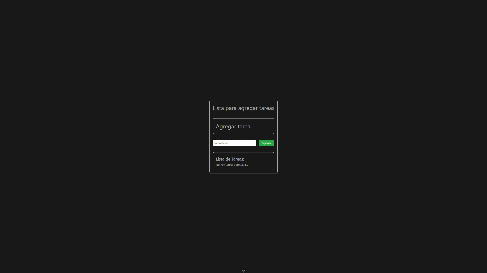

# 📝 Lista de Tareas con Vue 3

Una aplicación sencilla pero potente de "Lista de Tareas" (To-Do List) construida con Vue 3 y Vite. Este proyecto sirve como un ejercicio práctico para entender e implementar los conceptos fundamentales de los frameworks modernos basados en componentes.




## ✨ Características

- **Añadir tareas:** Un formulario intuitivo para agregar nuevas tareas a la lista.
- **Ver tareas:** Visualización clara de todas las tareas pendientes.
- **Eliminar tareas:** Posibilidad de eliminar tareas de la lista con un solo clic.
- **Componentizado:** La aplicación está estructurada en componentes reutilizables (`FormToDo`, `ListToDo`).

## 🛠️ Tecnologías Utilizadas

- 
- 
- 
- HTML5 y CSS3

## 🚀 Principios Fundamentales Implementados

El principal objetivo de este proyecto fue aplicar el patrón de arquitectura conocido como **"Flujo de Datos Unidireccional"**. Esto hace que la aplicación sea más predecible, fácil de depurar y escalable.

La comunicación entre componentes se gestionó de la siguiente manera:

### 1. Props Hacia Abajo (Parent -> Child) ⬇️

El estado principal de la aplicación (el array `tareas`) reside en el componente padre `App.vue`. Este componente es la **única fuente de verdad**.

Para que el componente `ListToDo.vue` pudiera mostrar las tareas, se le pasaron los datos a través de _props_:

```html
<ListToDo :tareas="tareas" />
```

### 2. Eventos Hacia Arriba (Child -> Parent) ⬆️

Los componentes hijos no modifican directamente el estado del padre. En su lugar, emiten eventos para notificar al padre sobre una acción del usuario.

**Para agregar una tarea**, el componente `FormToDo.vue` emite un evento `@agregar-tarea`. El padre lo escucha así:

```html
<FormToDo @agregar-tarea="handleAgregarTarea" />
```

**Para eliminar una tarea**, el componente `ListToDo.vue` emite un evento `@eliminar-tarea`. El padre lo escucha de esta manera:

```html
<ListToDo @eliminar-tarea="handleEliminarTarea" />
```

El componente `App.vue` escucha estos eventos y es el único responsable de ejecutar la lógica para modificar el array `tareas`.

### Diagrama de Flujo

```text
             [ App.vue ]
 (Maneja el estado `tareas` y la lógica)
               /       \
              /         \
  (props) :tareas │    │ @agregar-tarea (escucha)
             ↓           ↑
     [ ListToDo.vue ]   [ FormToDo.vue ]
(Muestra las tareas y    (Captura el input y
 emite @eliminar-tarea)   emite @agregar-tarea)
```

## ⚙️ Cómo ejecutar este proyecto localmente

Sigue estos pasos para tener una copia del proyecto funcionando en tu máquina.

### Prerrequisitos

- Node.js (versión 16 o superior)
- npm o pnpm

### Instalación

1. **Clona el repositorio**

   ```bash
   git clone [https://github.com/](https://github.com/)[tu-usuario]/[nombre-del-repositorio].git
   ```

2. **Navega a la carpeta del proyecto**

   ```bash
   cd [nombre-del-repositorio]
   ```

3. **Instala las dependencias**

   ```bash
   npm install
   ```

4. **Inicia el servidor de desarrollo**

   ```bash
   npm run dev
   ```

   La aplicación estará disponible en `http://localhost:5173` (o el puerto que indique Vite).

## 🔮 Posibles Mejoras Futuras

- [ ] Añadir funcionalidad para marcar tareas como "completadas".
- [ ] Filtrar tareas (todas, completadas, pendientes).
- [ ] Guardar las tareas en el `localStorage` del navegador para que persistan.
- [ ] Añadir animaciones para una mejor experiencia de usuario.

---

Creado por **Steven J. Silva Gomez** - [Tu Perfil de GitHub](https://github.com/Stevenjsg)
